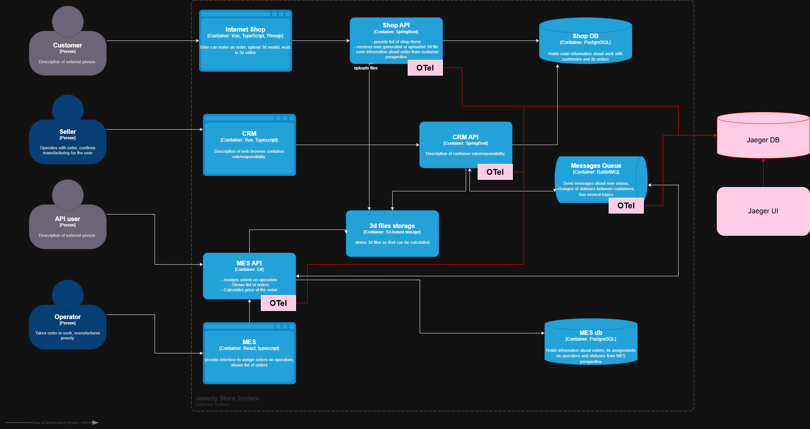

## Мотивация

### Критические точки отказа в системе

Анализ архитектуры выявил семь критических точек, где заказы могут "сломаться" или зависнуть. Shop API → RabbitMQ имеет критический приоритет трейсинга, поскольку заказ может быть создан, но не попасть в обработку из-за проблем с отправкой сообщений. RabbitMQ → MES API также критично, так как consumer может не обработать сообщение или оно попадет в Dead Letter Queue.

MES API Price Calculation требует особого внимания из-за длительных расчетов продолжительностью до 30 минут, которые могут зависать из-за ошибок обработки 3D модели или проблем с памятью. Database Operations создают риски блокировок в PostgreSQL и медленных запросов, что влияет на сохранение и чтение данных заказов.

### Влияние на бизнес-метрики

Трейсинг повлияет на пять ключевых метрик компании:
- Order Processing Time снизится с текущих месяцев до целевых 21 дня через выявление узких мест и измерение P50, P95, P99 времени от создания до закрытия заказа. 
- Order Success Rate повысится до 98%+ через предотвращение потерь заказов и измерение отношения успешно завершенных заказов к созданным.
- Customer Satisfaction улучшится через проактивное уведомление о задержках вместо реактивного решения жалоб, измеряемое через NPS и количество жалоб на просрочки. 
- Mean Time To Detection (MTTD) сократится с дней/недель до минут.
- Message Loss Rate станет видимым и минимизируется через отслеживание отношения отправленных к обработанным сообщениям.

## Предлагаемое решение

## Компромиссы

### Технические ограничения

MES система как проприетарное ПО может не поддерживать OpenTelemetry, что требует инструментирования только на уровне API calls или создания wrapper сервиса. Legacy интеграции потребуют постепенного покрытия начиная с критических путей, что создает риск неполной видимости на первом этапе.

Производительность пострадает на 1-5% latency из-за overhead трейсинга, что требует использования sampling rate 10% для production при 100% покрытии критических операций. Стоимость инфраструктуры значительна для хранения трейсов, что требует retention policy 30 дней детально и 6 месяцев агрегированно.
Невозможные сценарии

Внешние платежные системы не могут быть покрыты трейсингом внутри их API, только на уровне HTTP вызовов. Мобильные приложения, если появятся, потребуют отдельного SDK и подхода.

## Аспекты безопасности

### Контроль доступа и авторизация

Jaeger UI интегрируется с корпоративным SSO (LDAP/Active Directory) с доступом только для ролей "Support", "DevOps", "Architecture". Система использует временные токены и трехуровневую авторизацию: support_read для просмотра трейсов, devops_admin для конфигурации, business_metrics для бизнес-дашбордов.

### Защита данных

Сенситивные данные исключаются из трейсов — номера карт, пароли и персональные данные заменяются хешами или заглушками. Данные трейсов шифруются при хранении, все соединения используют TLS, а Jaeger компоненты размещаются в приватной сети.

Система ведет аудит доступа с логированием всех просмотров трейсов, включая пользователя, trace_id, timestamp и IP-адрес. Для соответствия GDPR предусмотрено автоматическое удаление трейсов при удалении пользователя и минимизация хранения персональных данных.
