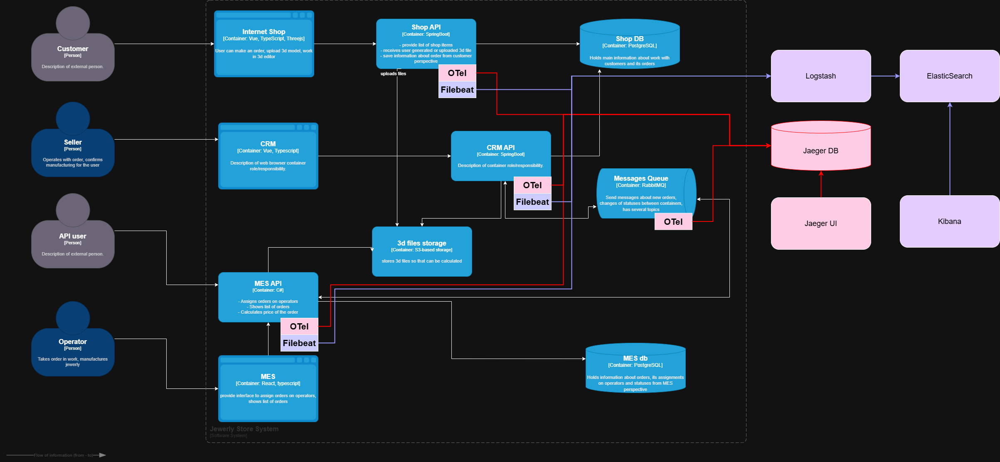

## Мотивация

### Мотивация для бизнеса:
- Мгновенный разбор любой нестандартной ситуации (удержание клиентов)
- Конкретный ответ клиенту за 10 минут (не часы/дни ожидания)
- Снижение нагрузки на специалистов поддержки: уход от «расспросов» к фактам
- Автоматический сбор статистики, отчетов для руководства (метрики: % успешных заказов, время обработки, % ошибок)
- Уменьшение потерь — прогнозирование DDoS/бот-атак, выявление циклических и массовых событий

### Показатели, которые можно улучшить с помощью логирования:
- Mean Time To Detect (MTTD) — время до обнаружения инцидента
- Mean Time To Recovery (MTTR) — время до восстановления работы
- Процент корректно обработанных заказов (Order Success Rate)
- Количество клиентских жалоб в день/неделю
- Количество отклонённых заказов из-за ошибок (технических/бизнес)

### Приоритет по системам
1) Shop API — первый путь заказа, основной источник ошибок и обращений.
2) MES API + RabbitMQ — критический этап, где сообщения могут теряться.
3) CRM API — подтверждение заказа; здесь важны бизнес-ошибки.
4) PostgreSQL + S3 — для аудита и поиска неочевидных причин отклонения.

Причина: максимальное влияние на бизнес и скорость реакции поддержки. Без логов этих систем невозможно выяснить причину большинства проблем.

## Предлагаемое решение

### Технологии:
- Centralized Logging (Elastic Stack (ELK), OpenSearch, можно рассматривать Splunk или Graylog).
- Все сервисы — structured logging (JSON, стандартная схема timestamp/service/level/message/ контекст).
- Прокидывание correlation/request-id для всех действий/запросов, связанно с заказом.
- Fluentd, Logstash или встроенные агенты (Filebeat) для агрегации логов.
- Индексация по отдельным системам (Shop, MES, CRM); retention — минимум 30 дней, для бизнес-аналитики — до 1 года (агрегированные события).
- Алгоритмы поиска аномалий (например, резкий всплеск заказов — потенциальная DDoS-атака).

### В схеме отмечаем красным:
- Log Collector (например, Logstash/Filebeat) на каждой целевой системе
- Центральное хранилище логов (Elasticsearch/OpenSearch).

### Анализ и алертинг:
- Настроить автоматический поиск ERROR/WARN записей, корреляцию по order_id/correlation_id.
- Настроить алерты: превышение числа ошибок за минуту, всплеск событий заказа, подозрительная активность (по IP, user-agent).

### Безопасность и политика хранения
- Доступ к логам: только DevOps, архитекторы и поддержка; настройка RBAC и аудита доступа.
- Маскирование/фильтрация: PII/финансовые/персональные данные не логируются, только безопасные business-идентификаторы/корреляционные ключи.
- Шифрование при хранении: лог-хранилище доступно только через TLS/приватную сеть, журналы активности пользователей.
- Политика хранения: индексы разделены по системам, срок хранения 30-90 дней для технических логов, 1 год для бизнес-аналитики (агрегаты).
