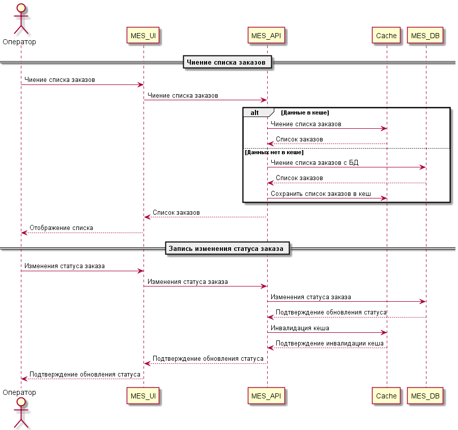

## Мотивация

### Точка роста

Операторы жалуются на медленную загрузку страниц MES; клиенты недовольны скоростью обработки и выполнением заказов.

Главный узкий момент — загрузка больших списков заказов и статистики, которые каждому пользователю повторно формируются из базы заново.

Это приводит к высокой нагрузке на БД и API, появлению задержек и неудовлетворенности сотрудников и клиентов.

### Цель кеширования
- Ускорить работу интерфейса MES для операторов и снизить нагрузку на базу данных;
- Предоставить почти мгновенный доступ к часто запрашиваемым данным (список заказов, фильтры, статистика по статусам);
- Улучшить масштабируемость, чтобы система выдерживала рост числа операторов и заказов без деградации производительности;
- Снизить стоимость инфраструктуры за счет оптимизации запросов к БД.

### Данные для кеширования
- Список заказов для дашборда оператора (критичный приоритет);
- Детализацию заказа (просмотр карточки заказа — высокий приоритет);
- Статистику по статусам заказов, виджеты и агрегаты (средний приоритет);
- Все данные, которые повторяются для нескольких пользователей/операторов.

## Предлагаемое решение

### Выбор типа кеширования

Типа кеширования: серверное

Почему серверное кеширование:
- Большая часть нагрузки и задержек возникает на сервере при построении сложных запросов к БД;
- В клиентском (браузерном) кешировании нет контроля над консистентностью — это не подходит для производственной системы;
- Серверный кеш позволяет управлять жизненным циклом данных гибко и централизованно.

### Выбор паттерна кеширования

Рекомендуемое: Cache-Aside (aka Lazy Loading)

Когда оператор запрашивает список заказов, MES API сперва обращается к кешу (например, Redis). Если там есть свежие данные — возвращает их из кеша, если нет — делает запрос к БД, кеширует и отдаёт результат оператору;

При изменении статуса заказа запись всегда идет через БД. После этого кеш соответствующего списка/фильтра инвалидациируется или обновляется.

Почему не Write-Through:

Write-Through хорош там, где нет сложной логики инвалидации, а записи происходят часто и равномерно, здесь же основная проблема — чтение больших одинаковых выборок;

Излишняя нагрузка на кеш при массовых изменениях статусов заказов, слишком дорогая реализация.

Почему не Refresh-Ahead:

Работает для очень горячих данных, которые запрашиваются строго каждые X секунд с одинаковыми параметрами;

Требует тонкой настройки и прогнозов, может привести к избыточным обновлениям.

### Стратегия инвалидации

Программная инвалидация по ключу:

При изменении статуса заказа или других критичных событий соответствующий ключ или набор ключей в Redis удаляются или обновляются, чтобы при следующем запросе новые операторы получили актуальные данные;

Для "стареющей" информации — временная (TTL) инвалидация (например, раз в 2-3 минуты обновляется агрегация);

Не используем глобальный flush или только временную стратегию, чтобы не создать лишних нагрузок на БД.

#### Сравнение стратегий инвалидации

| Стратегия             | Плюсы                                   | Минусы                                 | Применимость для MES   |
| --------------------- | --------------------------------------- | -------------------------------------- | ---------------------- |
| Временная (TTL)       | Просто, подходит для нечасто меняющихся | Данные кратко могут быть устаревшими   | Хорошо для агрегатов   |
| По ключу (событийная) | Всегда актуальные выборки после события | Необходима точная логика покрытия      | Оптимально для списков |
| Глобальная            | Быстро убирает старое                   | Сильная нагрузка при массовом удалении | Не рекомендуется       |
| Программная смешанная | Гибкость, минимизация нагрузок          | Сложнее реализовать                    | Максимальное покрытие  | 
